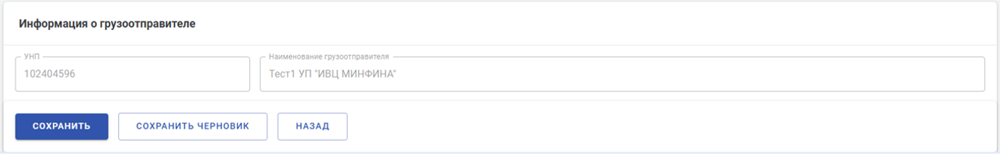
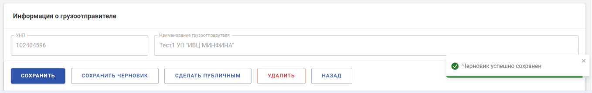

**ID**: SPEC-FEATURE-DELIVERY-NOTE-DRAFTS-V-1.00  
**Статус:** Утверждено  
**Дата создания:** 01.02.2026  
**Автор:** Дмитрий Хилько  
**Программный продукт:** EDI-Flow  
**Модуль:** Накладные      
**Основная функциональность:** Управление черновиками  

# БИЗНЕС-ТРЕБОВАНИЯ

## БИЗНЕС-ПРОБЛЕМА  

1. **Потери данных и времени**. В текущем интерфейсе системы все данные накладной теряются при любом 
прерывании сеанса работы пользователя: переход в другой раздел системы, таймаут из-за простоя, вход с другого 
устройства. Это вынуждает сотрудников повторно выполнять уже сделанную работу, что снижает личную эффективность и 
создает риски ошибок при повторном вводе.
2. **Отсутствие возможности заполнять накладную несколькими пользователями**. Ключевые организации-клиенты системы 
используют распределение заполнения различных разделов накладной между разными специалистами или отделами. 
Текущая система не позволяет работать над одной накладной последовательно несколькими пользователями, что является 
нарушением внутренних регламентов организаций-клиентов - вынуждает одного специалиста заполнять накладную: вносить свою 
и несвойственную ему информацию, что увеличивает время обработки накладной и риск ошибок ввода.

## БИЗНЕС-ЦЕЛИ

#### BG-DELIVERY-NOTE-DRAFTS-001
Исключить потери данных и времени пользователей при случайном прерывании сеанса создания накладной.

#### BG-DELIVERY-NOTE-DRAFTS-002
Обеспечить поддержку бизнес-процесса клиентов, когда над накладной работают несколько специалистов.

## КРИТЕРИИ УСПЕХА  

- SUC-DELIVERY-NOTE-DRAFTS-001: Сокращение количества жалоб и инцидентов, связанных с потерей данных при создании 
накладных, на 90% по сравнению со среднемесячным количеством за квартал до внедрения. Источник: система поддержки. 
- SUC-DELIVERY-NOTE-DRAFTS-002: Не менее 90% создаваемых в системе накладных, подлежащих заполнению группой 
специалистов, проходят через публичные черновики в течение квартала после внедрения. Источник: аналитика системы. 
- SUC-DELIVERY-NOTE-DRAFTS-003: Удовлетворенность пользователей функциональностью управления черновиками ≥ 4.5 из 5. 
Источник: опрос пользователей.

# БИЗНЕС-ПРАВИЛА ОБЩИЕ

### BR-DELIVERY-NOTE-DRAFTS-001
Ролевой доступ к функциям управления черновиками:
1. Имеют доступ пользователи с ролями: РАСХ, ПСХ.
2. Не имеют доступ пользователи с ролями: АИБ, АИС, ОТП, ГАСХ, АСХ, ЦБГО, АМНС, ОАМНС, РАМНС, АГТ, ПГТК.

### BR-DELIVERY-NOTE-DRAFTS-002
Приватный черновик можно создать для накладных следующих типов: ЭТН, ЭТТН, экспортной ЭТН, Электронного сообщения.  

### BR-DELIVERY-NOTE-DRAFTS-003
Публичный черновик можно создать для накладных следующих типов: ЭТН, ЭТТН, экспортной ЭТН, Электронного сообщения.  

# ПОЛЬЗОВАТЕЛЬСКИЕ ТРЕБОВАНИЯ (USE CASES)

### UC-DELIVERY-NOTE-DRAFTS-CREATE-001
**Название**: Создание и последующие сохранения приватного черновика
**BG:** [BG-DELIVERY-NOTE-DRAFTS-001](#bg-delivery-note-drafts-001)    
**Актор:** Пользователь с ролью [BR-DELIVERY-NOTE-DRAFTS-001](#br-delivery-note-drafts-001)  
**Предусловия:** Пользователь авторизован в системе, пользователь создал новую накладную типа 
[BR-DELIVERY-NOTE-DRAFTS-002](#br-delivery-note-drafts-002)  

**Основной поток**:
1. Пользователь начинает заполнять поля формы накладной
2. Пользователь вручную сохраняет введённые в накладную данные как приватный черновик
3. Система создаёт приватный черновик с введёнными данными
4. Система информирует пользователя об успешном создании приватного черновика
5. Пользователь остается на форме приватного черновика и продолжает заполнять поля формы
6. Пользователь вручную сохраняет введенные в приватный черновик данные
7. Система обновляет ранее созданный приватный черновик введёнными данными
8. Система информирует пользователя об успешном сохранении данных черновика

**Альтернативный поток A (Автосохранение приватного черновика)**:
1. На шаге 2/6 основного потока, пользователь не выполняет ручного сохранения
2. Система автоматически сохраняет изменения через заданный интервал времени
3. Система при первом автоматическом сохранении создаёт приватный черновик с введёнными данными
4. Система при втором и последующих автоматических сохранениях обновляет приватный черновик введёнными данными
5. Система информирует пользователя о прохождении автоматического сохранения
6. Система информирует пользователя об окончании автоматического сохранения

**Альтернативный поток B (Ошибка ручного создания/сохранения приватного черновика)**:
1. На шаге 3/7 основного потока возникает ошибка создания/сохранения приватного черновика
2. Система информирует пользователя об ошибке
3. Пользователь повторяет попытку создания/сохранения приватного черновика или продолжает работу без 
создания/сохранения приватного черновика

**Альтернативный поток С (Ошибка автосохранения приватного черновика)**:
1. На шаге 2 альтернативного потока А возникает ошибка сохранения
2. Система информирует пользователя об ошибке
3. Пользователь дожидается очередной попытки автосохранения или вручную сохраняет введённые данные накладной как 
приватный черновик

**Постусловия:** В разделе приватных черновиков появилась запись о созданном приватном черновике

# СОЗДАНИЕ ПРИВАТНОГО ЧЕРНОВИКА ПО ТРЕБОВАНИЮ ПОЛЬЗОВАТЕЛЯ

## ФУНКЦИОНАЛЬНЫЕ ТРЕБОВАНИЯ

### FR-DELIVERY-NOTE-DRAFTS-CREATE-001
**Название:** Создание приватного черновика по требованию пользователя  
**BG:** [BG-DELIVERY-NOTE-DRAFTS-001](#bg-delivery-note-drafts-001)  
**UC:** [UC-DELIVERY-NOTE-DRAFTS-CREATE-001, основной поток](#uc-delivery-note-drafts-create-001)  
**GUI:** [GUI-DELIVERY-NOTE-DRAFTS-001](#gui-delivery-note-drafts-001)  
**Тип:** create, complex (state-driven + event-driven)  

**Пока** пользователь имеет роль [BR-DELIVERY-NOTE-DRAFTS-001][1],  
**пока** отображена форма накладной типа [BR-DELIVERY-NOTE-DRAFTS-002][2],  
**пока** в форме накладной заполнено хотя бы одно поле,  
**когда** пользователь нажимает кнопку «Сохранить черновик»,  
**система должна** сохранить данные как приватный черновик в течение времени [NFR-PQ-PE-TB-001][3],  
**чтобы** предотвратить потерю данных при непредвиденном закрытии формы черновика.  

**Критерии приемки:**
- AC 1: В таблице базы данных создается новая уникальная запись с типом «Приватный».
- AC 2: Значения полей "Создан" и "Отредактирован" соответствуют [FR-DELIVERY-NOTE-DRAFTS-CREATE-003](#fr-delivery-note-drafts-create-003).
- AC 3: Созданный черновик доступен для просмотра и выбора в реестре приватных черновиков после успешного создания.
- AC 4: Пользователь остаётся на форме редактирования приватного черновика.

### FR-DELIVERY-NOTE-DRAFTS-CREATE-002
**Название:** Отсутствие валидации при создании приватного черновика по требованию пользователя  
**BG:** [BG-DELIVERY-NOTE-DRAFTS-001](#bg-delivery-note-drafts-001)  
**UC:** [UC-DELIVERY-NOTE-DRAFTS-CREATE-001, основной поток](#uc-delivery-note-drafts-create-001) 
**Тип:** create, event-driven  

**Когда** пользователь нажимает кнопку «Сохранить черновик»,  
**система должна** выполнить сохранение данных без проведения валидации полей формы накладной.  

**Критерии приемки:**
- AC 1: Система сохраняет черновик, даже если обязательные поля не заполнены.
- AC 2: При нажатии «Сохранить черновик» системные ошибки валидации (красные подсветки полей) не отображаются.

### FR-DELIVERY-NOTE-DRAFTS-CREATE-003
**Название:** Установка временных меток при создании приватного черновика по требованию пользователя  
**BG:** [BG-DELIVERY-NOTE-DRAFTS-001](#bg-delivery-note-drafts-001)  
**UC:** [UC-DELIVERY-NOTE-DRAFTS-CREATE-001, основной поток](#uc-delivery-note-drafts-create-001) 
**Тип:** create, event-driven  

**Когда** система создает новую запись в таблице черновиков базы данных,  
**система должна** установить значения полей created_at и modified_at равными текущей дате и времени сервера.  

**Критерии приемки:**
- AC 1: При создании новой записи в таблице drafts поля created_at и modified_at заполняются автоматически.
- AC 2: Значения в обоих полях (created_at и modified_at) идентичны в момент первой вставки (insert) записи.
- AC 3: Время записи соответствует системному времени сервера (Server Time) в формате ISO 8601 (рекомендуется UTC+3).
- AC 4: Погрешность между моментом совершения транзакции и записанным временем не превышает 1 секунду.
- AC 5: Значения сохраняются в формате YYYY-MM-DD HH:MM:SS.

### FR-DELIVERY-NOTE-DRAFTS-CREATE-004
**Название:** Изменение значения счётчика количества черновиков при создании приватного черновика  
**BG:** [BG-DELIVERY-NOTE-DRAFTS-001](#bg-delivery-note-drafts-001)  
**UC:** [UC-DELIVERY-NOTE-DRAFTS-CREATE-001, основной поток](#uc-delivery-note-drafts-create-001) 
**GUI:** TBD    
**Тип:** create, event-driven  

**Когда** система успешно создаёт приватный черновик накладной,  
**система должна** увеличить на 1 счётчик количества черновиков,  
**чтобы** пользователь видел, сколько черновиков имеется в системе.  

**Критерии приемки:**
- AC 1: Счётчик увеличился на 1 сразу после создания приватного черновика
- AC 2: Внешний вид и поведение счётчика полностью соответствуют TBD  

### FR-DELIVERY-NOTE-DRAFTS-CREATE-005
**Название:** Уведомление пользователя об успешном создании приватного черновика  
**BG:** [BG-DELIVERY-NOTE-DRAFTS-001](#bg-delivery-note-drafts-001)  
**UC:** [UC-DELIVERY-NOTE-DRAFTS-CREATE-001, основной поток](#uc-delivery-note-drafts-create-001)  
**GUI:** [GUI-DELIVERY-NOTE-DRAFTS-002](#gui-delivery-note-drafts-002)   
**Тип:** create, event-driven  

**Когда** система успешно создаёт приватный черновик накладной,  
**система должна** отобразить уведомление «Черновик успешно сохранен»,  
**чтобы** пользователь понял, что операция создания приватного черновика прошла успешно.  

**Критерии приемки:**
- AC 1: Уведомление появляется сразу после ответа сервера
- AC 2: Внешний вид и поведение уведомления полностью соответствуют [GUI-DELIVERY-NOTE-DRAFTS-002](#gui-delivery-note-drafts-002)

### FR-DELIVERY-NOTE-DRAFTS-CREATE-006
**Название:** Уведомление пользователя об ошибке создания приватного черновика  
**BG:** [BG-DELIVERY-NOTE-DRAFTS-001](#bg-delivery-note-drafts-001)  
**UC:** [UC-DELIVERY-NOTE-DRAFTS-CREATE-001, альтернативный поток B](#uc-delivery-note-drafts-create-001)  
**GUI:** TBD  
**Тип:** create, unwanted behavior  

**Если** системе не удается создать приватный черновик накладной,  
**то** система должна отобразить сообщение об ошибке «Не удалось сохранить черновик. Проверьте соединение и попробуйте ещё раз».

**Критерии приемки:**
- AC 1: Уведомление появляется сразу после ответа сервера
- AC 2: Внешний вид и поведение уведомления полностью соответствуют TBD.

## GUI-ТРЕБОВАНИЯ

### GUI-DELIVERY-NOTE-DRAFTS-001
**Название:** Кнопка создании приватного черновика, сохранении приватного/публичного черновика  
**Тип элемента:** Button (Кнопка)  
**FR:** [FR-DELIVERY-NOTE-DRAFTS-CREATE-001](#fr-delivery-note-drafts-create-001)

**Визуальное представление (прототип):**

**Описание поведения:**
- **Позиционирование:** Располагается правее кнопки "Сохранить". 
- **Состояния:**  

| Состояние             | Условие отображения                                            | Визуальные атрибуты                                          |
| :-------------------- | :------------------------------------------------------------- | :----------------------------------------------------------- |
| Hidden (по умолчанию) | Форма накладной пуста (не заполнено не одно поле)              | Отсутствуют                                                  |
| Visible               | Заполнено хотя бы одно поле формы накладной                    | Цвет: #FFFF, текст: "Сохранить черновик"                   |
| Saving                | Производится процесс создания/сохранения приватного черновика  | Текст скрыт, отображается Spinner-Small. Кнопка блокируется. |
| Success (Успех)       | Получен ответ «Успешно» от сервера                             | Кнопка возвращается в Visible, текст не меняется             |
| Hidden                | Успешное сохранение накладной после нажатия кнопки "Сохранить" | Отсутствуют                                                  |

### GUI-DELIVERY-NOTE-DRAFTS-002
**Название:** Уведомление об успешном создании приватного черновика, сохранении приватного/публичного черновика   
**Тип элемента:** Toast (Всплывающее уведомление)  
**FR:** [FR-DELIVERY-NOTE-DRAFTS-CREATE-005](#fr-delivery-note-drafts-create-005)

**Визуальное представление (прототип):**

**Описание поведения:**  
- **Триггер:** Успешное завершение создании приватного черновика, сохранении приватного/публичного черновика
- **Позиционирование:** Нижний правый угол экрана, поверх всех элементов
- **Контент:** Иконка Check-Circle (Зеленая), текст: «Черновик успешно сохранен»
- **Тайминг:** Автоматическое скрытие (Fade-out) через 5 секунд
- **Интерактив:** Наличие кнопки «Х» для закрытия пользователем

## НЕФУНКЦИОНАЛЬНЫЕ ТРЕБОВАНИЯ

### NFR-PQ-PE-TB-DELIVERY-NOTE-DRAFTS-001
**Наименование:**: Среднее время автосохранения черновика накладной  
**BG:** [BG-DELIVERY-NOTE-DRAFTS-001](#bg-delivery-note-drafts-001)  
**UC:** [UC-DELIVERY-NOTE-DRAFTS-CREATE-001, альтернативный поток А](#uc-delivery-note-drafts-create-001)  
**FR:** [FR-DELIVERY-NOTE-DRAFTS-CREATE-002](#fr-delivery-note-drafts-create-002)  
**Атрибут качества:** Performance Efficiency  
**Податрибут:** Time behavior  
**Приоритет:** High  

**Описание:** Среднее время автосохранения черновика накладной при стандартной нагрузке должно быть не более 0,5 секунды 
без блокировки UI. Измеряется на базе 95% запросов, выполненных за период.  
**Шкала измерения:** Time  
**Единица измерения:** milliseconds  

**Уровни:**  
**Текущий:** Не измерялось  
**Минимально допустимый:** ≤ 1000 ms (для 95% запросов)  
**Целевой:** ≤ 500 ms (для 95% запросов)  
**Идеальный:** ≤ 300 ms (для 95% запросов)  

**Метод измерения:** Среднее время от получения HTTP-запроса до отправки ответа, включая обработку на сервере и запросы 
к базе данных.  
**Тестовый метод:** UI-тестирование для симуляции реальных запросов пользователей в условиях нормальной и повышенной 
нагрузки.  

## ТЕСТ-КЕЙСЫ

#### TC-DELIVERY-NOTE-DRAFTS-CREATE-001
**Наименование:** Создание приватного черновика по требованию пользователя     
**FR:** [FR-DELIVERY-NOTE-DRAFTS-CREATE-001](#fr-delivery-note-drafts-create-001)  
**Приоритет:** Высокий  

**Предусловия:**
- Пользователь авторизован с разрешенной для создания черновика ролью.
- Открыта форма создания новой накладной, допускающей создание черновика.

**Шаги выполнения**:
1. Заполнить любое обязательное или необязательное поле формы накладной.
2. Нажать кнопку "Сохранить черновик".

**Ожидаемый результат:**
- Система сохраняет данные. Время сохранения соответствует требованию.
- В БД создается запись черновика. Заполнены поля created_at и modified_at.
- Пользователь остается на той же форме редактирования.
- Появляется уведомление "Черновик успешно сохранен".

[1]: <#br-delivery-note-drafts-001>
[2]: <#br-delivery-note-drafts-002>
[3]: <../../../02-architecture/05-global-quality-attributes/NFR-PQ-PE-TB-001-Среднее время-отклика-v-1.0.md#>
[4]: <#nfr-pq-pe-tb-drafts-001>

["Я отказался от идеи такого обозначения детальных функциональностей в пользу полных русских названий **Детальная функциональность:** CREATE, READ, ACCESS CONTROL, SORT-FILTER, CREATE, UPDATE, DELETE, STATES-TRANSITIONS]: # 